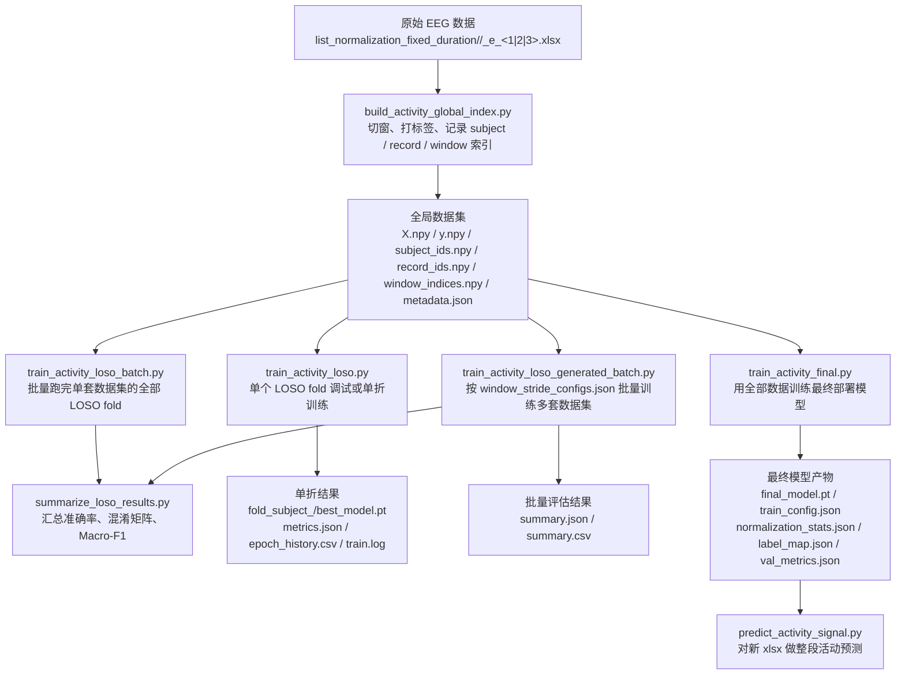

# EEG 服务器改动与使用说明

## 一图看懂：从数据处理到训练完成



### 流程图分支解释

> 严格来说，这里不是 `4` 条互不相关的分支，而是 **1 条主干数据线 + 3 条工作线**。

| 路径 | 对应脚本 | 主要输入 | 主要输出 | 对整体的作用 | 什么时候用 |
| --- | --- | --- | --- | --- | --- |
| **主干数据线** | `build_activity_global_index.py` | 原始 `xlsx` EEG 文件 | 全局窗口级数据集 | 把原始连续信号变成统一训练输入 | **所有后续流程都必须先走这一步** |
| **分支 1：单 fold 调试线** | `train_activity_loso.py` | 全局数据集 + `test_subject_id` | 单个 `fold_subject_<id>` 目录 | 验证单折 LOSO 训练是否正常 | 刚开始调试、试参数、查显存时用 |
| **分支 2：单套数据集 LOSO 实验线** | `train_activity_loso_batch.py` + `summarize_loso_results.py` | 1 套全局数据集 + 全部 subject | 所有 fold 结果 + `summary.json/csv` | 给出单套窗口参数下的正式评估结果 | 只评估 1 套窗口参数时用 |
| **分支 3：多套数据集批量实验线** | `train_activity_loso_generated_batch.py` | `window_stride_configs.json` + `global_activity_dataset/<window_...>` | `outputs/activity_loso/<window_...>/...` + 各自 summary | 自动批量比较多套窗口参数 | 想一次跑完多套窗口/步长配置时用 |
| **分支 4：最终部署模型线** | `train_activity_final.py` + `predict_activity_signal.py` | 全局数据集 / 最终模型目录 / 新 EEG 文件 | `final_model.pt` + 单文件预测结果 | 训练实际可用模型并预测新数据 | 实验完成后做实际使用时用 |


如果当前 Markdown 阅读器不支持 Mermaid，可以直接按下面这条文字路径理解：

```text
原始 xlsx EEG
-> build_activity_global_index.py（切窗 + 整理标签）
-> 全局活动分类数据集
   ├─> train_activity_loso.py（单个 LOSO fold）
   ├─> train_activity_loso_batch.py（单套数据集的全部 LOSO fold）
   │   └─> summarize_loso_results.py（汇总单套数据集实验结果）
   ├─> train_activity_loso_generated_batch.py（多套 window/stride 数据集批量训练）
   │   └─> summarize_loso_results.py（分别汇总每套数据集实验结果）
   └─> train_activity_final.py（训练最终部署模型）
       └─> predict_activity_signal.py（预测新 EEG 文件属于哪一类活动）
```

这张图里最常改的节点有 3 处：

1. **数据切窗阶段：** `window-seconds`、`stride-seconds`
2. **训练阶段：** `epochs`、`batch-size`、`lr`、`device`
3. **最终模型阶段：** `val-fraction`

## 按流程理解：每一步使用什么文件、产生什么文件、对整体有什么用

这一节不再按“代码目录”看，而是按**实际工作流程**来看。你可以把整条链路理解成：

```text
原始 EEG 文件
-> 构建全局数据集
-> 做 LOSO 实验
-> 汇总实验结果
-> 训练最终部署模型
-> 预测新信号
```

### 过程 1：原始数据准备

**主要使用的文件：**

```text
eeg-data-processing/data_to_list/list_normalization_fixed_duration/
  <subject>/
    <subject>_e_1.xlsx
    <subject>_e_2.xlsx
    <subject>_e_3.xlsx
```

**这一步产生什么：**

- 这一步本身不产生新文件，它是整条流程的原始输入

**对整体有什么用：**

- 提供每个受试者、每类活动的连续 EEG 信号
- 是后续切窗和训练的源头

### 过程 2：构建全局活动分类数据集

**对应脚本：**

- `eeg-data-processing/data_to_list/build_activity_global_index.py`

**脚本内部复用的文件：**

- `eeg-data-processing/data_to_list/8.xlsx_to_npy_dataset.py`
  - 复用了其中的 xlsx 读取、时间解析、采样间隔估计、切窗逻辑

**主要读取的文件：**

- `list_normalization_fixed_duration/<subject>/<subject>_e_<1|2|3>.xlsx`

**主要产生的文件：**

```text
global_activity_dataset/
├── X.npy
├── y.npy
├── subject_ids.npy
├── record_ids.npy
├── window_indices.npy
└── metadata.json
```

**这些输出分别干什么：**

| 文件 | 作用 |
| --- | --- |
| `X.npy` | 所有窗口的 EEG 数据本体 |
| `y.npy` | 每个窗口对应的活动类别 |
| `subject_ids.npy` | 记录窗口来自哪个受试者 |
| `record_ids.npy` | 记录窗口来自哪段原始活动文件 |
| `window_indices.npy` | 记录窗口在原始连续信号中的顺序 |
| `metadata.json` | 记录标签映射、窗口秒数、步长等元信息 |

**对整体有什么用：**

- 把原始的“按文件存储的连续 EEG”转换成“按样本存储的统一数据集”
- 后面的训练脚本都不再直接读原始 xlsx，而是读这套全局数据集

### 过程 3：单个 LOSO fold 调试 / 训练

**对应脚本：**

- `EEG-Conformer/train_activity_loso.py`

**主要读取的文件：**

```text
global_activity_dataset/
├── X.npy
├── y.npy
├── subject_ids.npy
└── metadata.json
```

**主要产生的文件：**

```text
outputs/activity_loso/fold_subject_<id>/
├── best_model.pt
├── metrics.json
├── test_predictions.npz
├── epoch_history.csv
├── epoch_history.json
└── train.log
```

**这些输出分别干什么：**

| 文件 | 作用 |
| --- | --- |
| `best_model.pt` | 当前 LOSO fold 的最佳模型参数 |
| `metrics.json` | 当前 fold 的训练与测试指标 |
| `test_predictions.npz` | 当前 fold 的测试集真实标签和预测标签 |
| `epoch_history.csv` | 每个 epoch 的 `train_loss / train_acc / test_loss / test_acc / best_test_acc`，适合直接画曲线 |
| `epoch_history.json` | 与 CSV 对应的结构化历史数据，适合程序读取 |
| `train.log` | 当前 fold 的完整文本日志，方便回看训练过程 |

**对整体有什么用：**

- 先验证某 1 个 LOSO fold 能不能正常训练
- 是正式 batch LOSO 之前的单折调试入口

### 过程 4：批量跑完全部 LOSO fold

**对应脚本：**

- `EEG-Conformer/train_activity_loso_batch.py`

**主要读取的文件：**

- 全局数据集目录下的 `subject_ids.npy`
- 以及 `train_activity_loso.py` 运行单 fold 时需要的全部输入文件

**主要产生的文件：**

```text
outputs/activity_loso/
├── fold_subject_1/
├── fold_subject_2/
├── ...
└── fold_subject_11/
```

每个 `fold_subject_<id>/` 内部会生成：

```text
best_model.pt
metrics.json
test_predictions.npz
epoch_history.csv
epoch_history.json
train.log
```

**对整体有什么用：**

- 自动把所有受试者轮流留出测试
- 真正完成完整的 LOSO 实验

### 过程 4.5：按配置批量训练多套 window/stride 数据集

**对应脚本：**

- `EEG-Conformer/train_activity_loso_generated_batch.py`

**主要读取的文件：**

```text
eeg-data-processing/data_to_list/window_stride_configs.json
eeg-data-processing/data_to_list/global_activity_dataset/
└── window_<...>_stride_<...>/
    ├── X.npy
    ├── y.npy
    ├── subject_ids.npy
    └── metadata.json
```

**主要产生的文件：**

```text
EEG-Conformer/outputs/activity_loso/
└── window_<...>_stride_<...>/
    ├── fold_subject_1/
    ├── fold_subject_2/
    ├── ...
    ├── summary.json
    └── summary.csv
```

**对整体有什么用：**

- 按 `window_stride_configs.json` 自动遍历多套已生成的数据集
- 每套数据集内部复用 `train_activity_loso_batch.py` 跑完全部 fold
- 每套数据集训练后自动调用 `summarize_loso_results.py`
- 新增 JSON 配置时，只补跑没训练过的数据集，不用从头全部重跑

### 过程 5：汇总 LOSO 实验结果

**对应脚本：**

- `EEG-Conformer/summarize_loso_results.py`

**主要读取的文件：**

```text
outputs/activity_loso/fold_subject_<id>/
├── metrics.json
└── test_predictions.npz
```

**主要产生的文件：**

```text
outputs/activity_loso/
├── summary.json
└── summary.csv
```

**这些输出分别干什么：**

| 文件 | 作用 |
| --- | --- |
| `summary.json` | 完整实验汇总，适合程序读取 |
| `summary.csv` | 表格化汇总，适合快速查看 |

**对整体有什么用：**

- 把每个 fold 的结果汇总成总结果
- 给出整体准确率、混淆矩阵、Macro-F1
- 这是正式实验报告最核心的结果入口

### 过程 6：训练最终部署模型

**对应脚本：**

- `EEG-Conformer/train_activity_final.py`

**脚本内部复用的文件：**

- `EEG-Conformer/train_activity_loso.py`
  - 复用模型定义、评估函数和部分统计逻辑

**主要读取的文件：**

```text
global_activity_dataset/
├── X.npy
├── y.npy
├── record_ids.npy
├── window_indices.npy
└── metadata.json
```

**主要产生的文件：**

```text
outputs/activity_final/
├── final_model.pt
├── train_config.json
├── normalization_stats.json
├── label_map.json
└── val_metrics.json
```

**这些输出分别干什么：**

| 文件 | 作用 |
| --- | --- |
| `final_model.pt` | 最终实际部署用的模型 |
| `train_config.json` | 记录训练时的模型结构和参数 |
| `normalization_stats.json` | 推理时做标准化必须使用的均值和标准差 |
| `label_map.json` | 保存类别标签映射关系 |
| `val_metrics.json` | 最终模型训练时的验证结果 |

**对整体有什么用：**

- LOSO 是“评估模型泛化能力”
- Final 是“用全部数据训练一个实际可用模型”

### 过程 7：对新 EEG 文件做预测

**对应脚本：**

- `EEG-Conformer/predict_activity_signal.py`

**脚本内部复用的文件：**

- `eeg-data-processing/data_to_list/8.xlsx_to_npy_dataset.py`
- `EEG-Conformer/train_activity_loso.py`

**主要读取的文件：**

```text
输入 EEG 文件：
  list_normalization_fixed_duration/.../*.xlsx

模型目录：
  outputs/activity_final/
  ├── final_model.pt
  ├── train_config.json
  ├── normalization_stats.json
  └── label_map.json
```

**主要产生的文件：**

- 终端打印预测结果
- 可选输出：

```text
predict_activity_result.json
```

**对整体有什么用：**

- 把训练好的最终模型真正用于新信号分类
- 输出“这段 EEG 更像 `e_1 / e_2 / e_3` 中哪一类活动”

### 一句话总结整条链路

如果只用一句话概括：

> `build_activity_global_index.py` 负责把原始 xlsx 变成可训练数据，`train_activity_loso*.py` 负责做正式 LOSO 实验，`summarize_loso_results.py` 负责出总评估结果，`train_activity_final.py` 负责出最终可部署模型，`predict_activity_signal.py` 负责把最终模型真正用起来。

---

本文档说明以下 4 件事：

1. 我在服务器 `/public/home/gd_110413/SWT/EEG` 下**改了或新增了哪些文件**
2. 运行脚本后在服务器上**实际产生了哪些文件**
3. 现在这套 **EEG-Conformer 活动三分类流程** 应该怎么使用
4. 这套流程与原版 **EEG-Conformer** 相比，**哪些地方保持一致，哪些地方做了适配**

> 说明：本文优先列出**项目目录内**我直接修改、上传或运行后产出的文件。像 `pip install openpyxl` 这类依赖安装会在虚拟环境的 `site-packages` 下生成大量内部文件，这类文件不逐个枚举，但会在「环境变更」部分单独说明。

---

## 1. 服务器上的代码改动总览

### 1.1 服务器路径基准

- **服务器工作目录：** `/public/home/gd_110413/SWT/EEG`
- **项目环境 Python：** `/public/home/gd_110413/SWT/EEG/EEG-Conformer/.conda-envs/eegconformer310/bin/python`
- **原始活动数据目录：** `/public/home/gd_110413/SWT/EEG/eeg-data-processing/data_to_list/list_normalization_fixed_duration`

### 1.2 新增或同步到服务器的脚本文件

以下文件已经存在于服务器项目目录中：

```text
/public/home/gd_110413/SWT/EEG/
├── eeg-data-processing/
│   └── data_to_list/
│       └── build_activity_global_index.py
└── EEG-Conformer/
    ├── train_activity_loso.py
    ├── train_activity_loso_batch.py
    ├── train_activity_loso_generated_batch.py
    ├── summarize_loso_results.py
    ├── train_activity_final.py
    └── predict_activity_signal.py
```

它们的定位分别是：

| 文件 | 作用 |
| --- | --- |
| `build_activity_global_index.py` | 从 `list_normalization_fixed_duration` 读取 xlsx，切成窗口，构建**全局活动分类数据集** |
| `train_activity_loso.py` | 正式的 **LOSO（留一受试者法）** 单 fold 三分类训练脚本 |
| `train_activity_loso_batch.py` | 批量跑完所有 LOSO fold |
| `train_activity_loso_generated_batch.py` | 按 `window_stride_configs.json` 批量训练多套 `window_<...>_stride_<...>` 数据集，并自动汇总 |
| `summarize_loso_results.py` | 汇总所有 fold 的指标、混淆矩阵、Macro-F1 |
| `train_activity_final.py` | 用全部数据训练最终可部署模型 |
| `predict_activity_signal.py` | 用最终模型对新 EEG xlsx 做整段活动预测 |

### 1.3 环境层面的变更

服务器项目环境中做过以下实际变更：

1. 之前为兼容 `torch 1.12.1+cu113`，在项目环境内将 `numpy` 固定到了 `< 2`
2. 本次为了读取 `.xlsx`，在项目环境内安装了 `openpyxl`

环境路径仍然是：

```text
/public/home/gd_110413/SWT/EEG/EEG-Conformer/.conda-envs/eegconformer310
```

---

## 2. 服务器上实际产生的文件

本节列出当前已经在服务器上落盘的文件，包括旧的 smoke run 产物和本次 LOSO 三分类流程的产物。

## 2.1 历史 smoke run 产物（对应脚本已移除）

这些文件来自更早阶段的单 subject smoke run，用来验证 CUDA、数据读取和训练链路是否正常；对应脚本现在已经从当前仓库中移除：

```text
/public/home/gd_110413/SWT/EEG/EEG-Conformer/outputs/custom_npy/
├── subject_1_holdout_0.pt
├── subject_1_holdout_1.pt
├── subject_1_holdout_2.pt
├── subject_2_holdout_0.pt
├── subject_2_holdout_1.pt
├── subject_2_holdout_2.pt
├── subject_3_holdout_0.pt
├── subject_3_holdout_1.pt
├── subject_3_holdout_2.pt
├── subject_4_holdout_0.pt
├── subject_4_holdout_1.pt
├── subject_4_holdout_2.pt
├── subject_5_holdout_0.pt
├── subject_5_holdout_1.pt
├── subject_5_holdout_2.pt
├── subject_6_holdout_0.pt
├── subject_6_holdout_1.pt
├── subject_6_holdout_2.pt
├── subject_7_holdout_0.pt
├── subject_7_holdout_1.pt
├── subject_7_holdout_2.pt
├── subject_8_holdout_0.pt
├── subject_8_holdout_1.pt
├── subject_8_holdout_2.pt
├── subject_9_holdout_0.pt
├── subject_9_holdout_1.pt
├── subject_9_holdout_2.pt
├── subject_10_holdout_0.pt
├── subject_10_holdout_1.pt
├── subject_10_holdout_2.pt
├── subject_11_holdout_0.pt
├── subject_11_holdout_1.pt
└── subject_11_holdout_2.pt
```

这些 `.pt` 文件的含义不是最终三分类模型，而是：

- 每个 `subject`
- 每个 `holdout_group`
- 跑出来的一个 checkpoint

它们的价值是**链路验证**，不是最终论文式实验结果。

## 2.2 本次正式流程：全局数据集 smoke 产物

这部分文件来自 `build_activity_global_index.py` 对真实 3 个受试者子集的构建结果：

```text
/public/home/gd_110413/SWT/EEG/eeg-data-processing/data_to_list/global_activity_dataset_smoke/
├── X.npy
├── y.npy
├── subject_ids.npy
├── record_ids.npy
├── window_indices.npy
└── metadata.json
```

各文件作用如下：

| 文件 | 作用 |
| --- | --- |
| `X.npy` | 所有窗口 EEG 数据，形状是 `(N, C, T)` |
| `y.npy` | 每个窗口的活动标签，值为 `0 / 1 / 2` |
| `subject_ids.npy` | 每个窗口属于哪个受试者 |
| `record_ids.npy` | 每个窗口属于哪一个原始活动文件 |
| `window_indices.npy` | 窗口在原始连续信号中的顺序编号 |
| `metadata.json` | 标签映射、窗口参数、样本统计等元信息 |

本次 smoke 数据集的实际形状为：

```text
X = (954, 21, 640)
```

也就是说：

- 一共 `954` 个窗口样本
- 每个窗口 `21` 个公共 EEG 通道（统一去除 `A1/A2`）
- 每个窗口 `640` 个时间点

## 2.3 本次正式流程：单 fold LOSO smoke 产物

```text
/public/home/gd_110413/SWT/EEG/EEG-Conformer/outputs/activity_loso_smoke/
└── fold_subject_1/
    ├── best_model.pt
    ├── metrics.json
    └── test_predictions.npz
```

各文件作用如下：

| 文件 | 作用 |
| --- | --- |
| `best_model.pt` | 当前 fold 上测试准确率最高时保存的模型参数 |
| `metrics.json` | 当前 fold 的训练/测试统计信息 |
| `test_predictions.npz` | 测试集真实标签与预测标签，供后续汇总 |

## 2.4 本次正式流程：3 fold batch LOSO smoke 产物

```text
/public/home/gd_110413/SWT/EEG/EEG-Conformer/outputs/activity_loso_smoke_batch/
├── fold_subject_1/
│   ├── best_model.pt
│   ├── metrics.json
│   └── test_predictions.npz
├── fold_subject_2/
│   ├── best_model.pt
│   ├── metrics.json
│   └── test_predictions.npz
├── fold_subject_3/
│   ├── best_model.pt
│   ├── metrics.json
│   └── test_predictions.npz
├── summary.csv
└── summary.json
```

其中：

- `fold_subject_x/`：单个 LOSO fold 的结果目录
- `summary.json`：机器可读的完整汇总
- `summary.csv`：便于快速查看的表格版汇总

## 2.5 本次正式流程：最终模型 smoke 产物

```text
/public/home/gd_110413/SWT/EEG/EEG-Conformer/outputs/activity_final_smoke/
├── final_model.pt
├── train_config.json
├── normalization_stats.json
├── label_map.json
└── val_metrics.json
```

各文件作用如下：

| 文件 | 作用 |
| --- | --- |
| `final_model.pt` | 最终部署模型参数 |
| `train_config.json` | 模型结构和训练配置 |
| `normalization_stats.json` | 推理时用到的标准化均值和标准差 |
| `label_map.json` | 标签映射，例如 `e_1 -> 0` |
| `val_metrics.json` | 最终模型训练时的验证集指标 |

## 2.6 本次正式流程：预测结果文件

```text
/public/home/gd_110413/SWT/EEG/EEG-Conformer/outputs/predict_activity_smoke.json
```

这个 JSON 文件保存一次完整的整段信号预测结果，包括：

- `predicted_label`
- `predicted_activity`
- `average_probabilities`
- `n_windows`
- `input_file`
- `model_dir`

本次真实预测 smoke 的结果是：

- 输入：`1_e_3.xlsx`
- 输出：预测为 **`e_3`**

## 2.7 服务器上产生的日志文件

```text
/public/home/gd_110413/SWT/EEG/EEG-Conformer/logs/
├── activity_pipeline_rest_smoke.log
├── activity_pipeline_smoke.log
├── build_activity_global_index.log
└── train_activity_loso_smoke.log
```

这些日志文件的作用主要是：

- 记录后台 smoke run 的执行输出
- 记录失败原因
- 方便后续复盘

---

## 3. 完整使用流程

下面按正式使用顺序介绍整条流程。

## 3.1 第 0 步：进入项目目录与环境

先进入服务器项目目录：

```bash
cd /public/home/gd_110413/SWT/EEG
```

推荐直接使用项目环境里的 Python：

```bash
./EEG-Conformer/.conda-envs/eegconformer310/bin/python --version
```

这样做的作用是：

- 避免 `base` 环境依赖不一致
- 确保 `torch + CUDA + openpyxl` 都是当前流程验证过的版本

## 3.2 第 1 步：从 xlsx 构建全局活动数据集

命令：

```bash
./EEG-Conformer/.conda-envs/eegconformer310/bin/python ./eeg-data-processing/data_to_list/build_activity_global_index.py \
  --input-root ./eeg-data-processing/data_to_list/list_normalization_fixed_duration \
  --output-root ./eeg-data-processing/data_to_list/global_activity_dataset \
  --window-seconds 5 \
  --stride-seconds 5
```

这一步的作用是：

1. 遍历所有受试者目录
2. 读取每个 `*_e_1.xlsx / *_e_2.xlsx / *_e_3.xlsx`
3. 把连续 EEG 信号切成固定长度窗口
4. 给每个窗口附上活动标签、受试者编号和来源记录信息
5. 生成后续训练统一读取的全局数据集

### 这一步可以改什么

| 参数 | 默认示例 | 作用 | 改大 / 改小的影响 |
| --- | --- | --- | --- |
| `--window-seconds` | `5` | 每个窗口的长度 | 改大：单样本时间更长；改小：样本数更多 |
| `--stride-seconds` | `5` | 窗口滑动步长 | 小于窗口长度时会产生重叠窗口 |
| `--input-root` | `list_normalization_fixed_duration` | 原始 xlsx 数据目录 | 允许切换数据源 |
| `--output-root` | `global_activity_dataset` | 构建结果目录 | 允许保留多套不同窗口参数的数据集 |

### 关于 `window-seconds` 和 `stride-seconds`

这是整条流程里最重要、最常改的参数之一。

- `window-seconds = 5`
  - 表示每个训练样本取 `5 s` 的 EEG 信号
- `stride-seconds = 5`
  - 表示窗口不重叠
- 如果改成：

```text
window = 5
stride = 2.5
```

就会得到**重叠窗口**。优点是样本数会增加，缺点是相邻样本更相似，训练和验证时更要注意信息泄漏。

## 3.3 第 2 步：跑单个 LOSO fold

命令：

```bash
./EEG-Conformer/.conda-envs/eegconformer310/bin/python ./EEG-Conformer/train_activity_loso.py \
  --dataset-root ./eeg-data-processing/data_to_list/global_activity_dataset \
  --test-subject-id 1 \
  --epochs 200 \
  --batch-size 72 \
  --device cuda:0 \
  --output-dir ./EEG-Conformer/outputs/activity_loso
```

这一步的作用是：

1. 从全局数据集中取出 `subject 1` 作为测试集
2. 其余受试者作为训练集
3. 用训练集统计量做标准化
4. 训练 1 个符合原版 EEG-Conformer 主体结构的模型
5. 输出当前 fold 的模型和指标

### 这一步可以改什么

| 参数 | 作用 |
| --- | --- |
| `--test-subject-id` | 指定本次留出的测试受试者 |
| `--epochs` | 训练轮数 |
| `--batch-size` | batch 大小 |
| `--lr` | 学习率 |
| `--device` | 设备，例如 `cuda:0`、`cuda:1`、`cpu` |
| `--output-dir` | 当前 fold 结果的父目录 |

### 这一步的输出是什么

每跑 1 个 fold，会生成：

```text
fold_subject_<id>/
├── best_model.pt
├── metrics.json
├── test_predictions.npz
├── epoch_history.csv
├── epoch_history.json
└── train.log
```

其中：

- `epoch_history.csv`：最适合直接用 Excel、Pandas 或画图脚本查看每个 epoch 曲线
- `epoch_history.json`：保留同样的历史信息，但更适合程序化读取
- `train.log`：把终端里的 epoch 日志也写到文件里，方便服务器上回看

## 3.4 第 3 步：批量跑完全部 LOSO fold

命令：

```bash
./EEG-Conformer/.conda-envs/eegconformer310/bin/python ./EEG-Conformer/train_activity_loso_batch.py \
  --dataset-root ./eeg-data-processing/data_to_list/global_activity_dataset \
  --epochs 200 \
  --batch-size 72 \
  --device cuda:0 \
  --output-dir ./EEG-Conformer/outputs/activity_loso
```

如果只想跑部分受试者，可以加：

```bash
--subject-ids 1,2,3
```

这一步的作用是：

- 自动遍历所有受试者
- 对每个 subject 各跑一个 LOSO fold
- 把全部 fold 的结果保存到统一目录

### 这一步适合什么时候用

- 正式实验时用它
- 不再手动一个个运行 `train_activity_loso.py`

### 如果你有多套 `window / stride` 数据集

如果你先用 `generate_datasets.py` 按 `window_stride_configs.json` 生成了多套数据集，例如：

```text
eeg-data-processing/data_to_list/global_activity_dataset/
├── window_1_stride_1/
├── window_3_stride_3/
├── window_5_stride_5/
└── ...
```

那么不要再手动对每一套数据分别运行 `train_activity_loso_batch.py`，而是直接运行：

```bash
./EEG-Conformer/.conda-envs/eegconformer310/bin/python ./EEG-Conformer/train_activity_loso_generated_batch.py \
  --config ./eeg-data-processing/data_to_list/window_stride_configs.json \
  --dataset-base ./eeg-data-processing/data_to_list/global_activity_dataset \
  --output-base ./EEG-Conformer/outputs/activity_loso \
  --epochs 200 \
  --batch-size 72 \
  --device cuda:0
```

这个脚本会：

1. 读取 `window_stride_configs.json`
2. 找到对应的 `global_activity_dataset/window_<...>_stride_<...>/`
3. 对每套数据集复用 `train_activity_loso_batch.py` 跑完全部 fold
4. 为每套数据集自动调用 `summarize_loso_results.py`
5. 把结果写到：

```text
EEG-Conformer/outputs/activity_loso/window_<...>_stride_<...>/
```

它默认会跳过已经完整训练过的数据集；如果你想强制重跑，可以加：

```bash
--no-skip-existing
```

## 3.5 第 4 步：汇总 LOSO 结果

命令：

```bash
./EEG-Conformer/.conda-envs/eegconformer310/bin/python ./EEG-Conformer/summarize_loso_results.py \
  --output-dir ./EEG-Conformer/outputs/activity_loso
```

这一步的作用是：

1. 读取每个 fold 的 `metrics.json`
2. 读取每个 fold 的 `test_predictions.npz`
3. 计算总体混淆矩阵
4. 计算 Macro-F1
5. 输出 `summary.json` 和 `summary.csv`

如果只看单个 `best_model.pt`，你只能知道某一折的情况；这一步才是**论文式评估汇总**。

## 3.6 第 5 步：训练最终部署模型

命令：

```bash
./EEG-Conformer/.conda-envs/eegconformer310/bin/python ./EEG-Conformer/train_activity_final.py \
  --dataset-root ./eeg-data-processing/data_to_list/global_activity_dataset \
  --epochs 200 \
  --batch-size 72 \
  --device cuda:0 \
  --output-dir ./EEG-Conformer/outputs/activity_final
```

这一步的作用是：

- 不再留出测试受试者
- 直接用**全部数据**训练一个最终可部署模型
- 但仍然在每个 `record_id` 内按时间顺序切出验证集，用于挑选最佳模型

### 这里和 LOSO 的区别

| 脚本 | 用途 |
| --- | --- |
| `train_activity_loso.py` | 做实验评估，回答「模型能不能泛化到没见过的受试者」 |
| `train_activity_final.py` | 做最终部署，回答「我要一个实际可预测新信号的模型」 |

### 这一步可以改什么

| 参数 | 作用 |
| --- | --- |
| `--val-fraction` | 每条原始记录中划给验证集的比例，默认 `0.2` |
| `--epochs` | 训练轮数 |
| `--batch-size` | batch 大小 |
| `--lr` | 学习率 |
| `--device` | 训练设备 |
| `--output-dir` | 最终模型输出目录 |

## 3.7 第 6 步：对新 EEG 信号做预测

命令：

```bash
./EEG-Conformer/.conda-envs/eegconformer310/bin/python ./EEG-Conformer/predict_activity_signal.py \
  --input ./eeg-data-processing/data_to_list/list_normalization_fixed_duration/1/1_e_3.xlsx \
  --model-dir ./EEG-Conformer/outputs/activity_final \
  --device cuda:0
```

如果希望保存预测结果 JSON，可以加：

```bash
--output-json ./EEG-Conformer/outputs/predict_activity_result.json
```

这一步的作用是：

1. 读取新的 `.xlsx`
2. 按训练时相同的窗口参数切窗
3. 用 `normalization_stats.json` 中的均值和标准差做标准化
4. 用 `final_model.pt` 对每个窗口打分
5. 对所有窗口的 softmax 概率做平均
6. 得到整段信号属于 `e_1 / e_2 / e_3` 的最终判断

### 这一步可以改什么

| 参数 | 作用 |
| --- | --- |
| `--input` | 要预测的 EEG xlsx 文件 |
| `--model-dir` | 最终模型目录 |
| `--output-json` | 是否把结果写入 JSON |
| `--device` | 推理设备 |
| `--window-seconds` | 覆盖训练配置中的窗口长度 |
| `--stride-seconds` | 覆盖训练配置中的窗口步长 |

通常不建议随意改 `--window-seconds` 和 `--stride-seconds`，除非你非常确定推理时要和训练时使用不同策略。

---

## 4. 常改参数与建议

下面列出最常用、最值得关注的参数。

## 4.1 数据切割相关

| 参数 | 出现位置 | 建议 |
| --- | --- | --- |
| `window_seconds` | `build_activity_global_index.py`、`predict_activity_signal.py` | 决定每个样本的时间长度 |
| `stride_seconds` | `build_activity_global_index.py`、`predict_activity_signal.py` | 决定窗口是否重叠 |

建议：

- **先固定 `5 s / 5 s` 跑通正式实验**
- 如果之后要做对比实验，再尝试：
  - `5 s / 2.5 s`
  - `4 s / 2 s`
  - `2 s / 1 s`

## 4.2 训练相关

| 参数 | 作用 | 建议 |
| --- | --- | --- |
| `epochs` | 训练轮数 | smoke run 用 `1~3`，正式实验建议更高 |
| `batch_size` | 显存占用与训练速度 | 显存紧张时先减小 |
| `lr` | 学习率 | 默认保持 `0.0002`，尽量先不要乱改 |
| `device` | 训练设备 | 服务器上优先 `cuda:0` |

## 4.3 数据划分相关

| 参数 | 位置 | 作用 |
| --- | --- | --- |
| `test_subject_id` | `train_activity_loso.py` | 指定测试受试者 |
| `subject_ids` | `train_activity_loso_batch.py` | 指定只跑部分 fold |
| `val_fraction` | `train_activity_final.py` | 最终模型中验证集比例 |

---

## 5. 与原版 EEG-Conformer 的详细对比

这部分最重要。因为这次改造不是「重写一个新模型」，而是：

**尽量保持原版 EEG-Conformer 的核心原理不变，只对数据接入、划分协议、输出组织方式做适配。**

## 5.1 保持一致的部分

下列核心部分是刻意与原版保持一致的：

| 项目 | 原版 | 现在的正式脚本 |
| --- | --- | --- |
| 主体结构 | `PatchEmbedding + TransformerEncoder + ClassificationHead` | 保持同一主干结构 |
| 浅层卷积 stem | `(1,25)` 时间卷积 + 全通道空间卷积 + `(1,75)` 池化 | 保持同样思路和核大小 |
| 注意力结构 | Multi-head self-attention | 保持一致 |
| `num_heads` | `5` | 保持为 `5` |
| 损失函数 | `CrossEntropyLoss` | 保持一致 |
| 优化器 | `Adam(lr=0.0002, betas=(0.5, 0.999))` | 保持一致 |
| 训练风格 | 每个 epoch 都在测试集 / 评估集上打分并记录 best acc | LOSO 训练脚本保持这个原版风格 |

也就是说，**模型的核心原理没有被改掉**。

## 5.2 必须做适配的部分

如果完全照抄原版代码，当前服务器数据是跑不起来的，所以以下地方必须适配。

| 项目 | 原版 EEG-Conformer | 当前适配版 |
| --- | --- | --- |
| 数据源 | 固定读取 SEED 数据文件 | 读取服务器上的 `.xlsx` |
| 数据结构 | 原版内部按固定格式组织 fold | 先构建全局数据集，再按 `subject_ids.npy` 划分 |
| 通道数 | 原版代码里空间卷积常写死为 `62` 通道 | 改成按当前数据动态读取，这里实际统一为 `21` 个公共 EEG 通道（去除 `A1/A2`） |
| 时间长度 | 原版很多地方默认 `1 s` 数据 | 当前数据每窗是 `640` 点，脚本按实际 `n_times` 动态推导 |
| 分类目标 | 原版对应 SEED 设置 | 当前明确是活动 `e_1 / e_2 / e_3` 三分类 |
| 评估协议 | 原版示例脚本是严格 `5-fold CV` | 当前正式实验协议改为 **LOSO（11 个受试者）** |
| 部署模型 | 原版主要关注实验训练 | 当前额外补了 `train_activity_final.py` 和 `predict_activity_signal.py` |

## 5.3 原版与当前流程的根本区别

### 区别 1：划分单位不同

- **原版：** 样本在原始 SEED 数据协议下做 `5-fold`
- **当前：** 以受试者为单位做 LOSO

当前这样做的原因是：你的目标不是复现 SEED 的 5-fold 数字，而是评估：

> 模型能不能在**没见过的受试者**上，识别出这是活动 `1 / 2 / 3` 中的哪一类。

### 区别 2：新增了「最终部署模型」这条线

原版更多是「实验评估脚本」思路。

而当前多补了一条：

```text
全部数据
-> train_activity_final.py
-> final_model.pt
-> predict_activity_signal.py
```

这样你不只是有论文式实验结果，还有一个实际可用的部署模型。

### 区别 3：新增了项目环境自动适配

当前脚本还额外考虑了服务器使用体验，例如：

- 项目环境固定在 `EEG-Conformer/.conda-envs/eegconformer310`
- 可以直接指定 `cuda:0`
- 避免强依赖 `einops`
- 输出目录更清晰

这些属于**工程化适配**，不是模型原理上的篡改。

## 5.4 哪些不是“原版方法”的部分

下面这些地方要明确知道：它们是为了适配你的实际任务新增的，不属于原版代码自带能力。

| 功能 | 是否原版自带 | 说明 |
| --- | --- | --- |
| `build_activity_global_index.py` | 否 | 为你的 xlsx 数据新增的全局构建脚本 |
| `train_activity_loso.py` | 否 | 原版没有针对你这套目录结构的 LOSO 入口 |
| `train_activity_loso_batch.py` | 否 | 为了批量跑 11 个受试者新增 |
| `train_activity_loso_generated_batch.py` | 否 | 为了按 `window_stride_configs.json` 批量训练多套数据集新增 |
| `summarize_loso_results.py` | 否 | 为了统一汇总 Macro-F1 和混淆矩阵新增 |
| `train_activity_final.py` | 否 | 原版没有你这条部署模型训练线 |
| `predict_activity_signal.py` | 否 | 原版没有直接对单个 xlsx 做整段预测的脚本 |

但要注意：

> 这些新增脚本是**流程适配**，不是把 EEG-Conformer 模型原理改成了别的模型。

---

## 6. 当前建议怎么用

如果你的目标是尽快得到正式结果，建议按下面顺序：

1. 先决定你是要评估 **1 套窗口参数**，还是 **多套窗口参数**
2. 如果只评估 1 套，就先构建 1 套正式全局数据集，再用 `train_activity_loso_batch.py`
3. 如果要批量比较多套窗口参数，就先用 `generate_datasets.py` 生成多套数据集，再用 `train_activity_loso_generated_batch.py`
4. 看 LOSO 总体结果是否满意
5. 如果结果满意，再跑 `train_activity_final.py`
6. 最后用 `predict_activity_signal.py` 对单段新信号做预测

### 方案 A：只跑 1 套窗口参数（例如 `window=5, stride=5`）

```bash
cd /public/home/gd_110413/SWT/EEG

./EEG-Conformer/.conda-envs/eegconformer310/bin/python ./eeg-data-processing/data_to_list/build_activity_global_index.py \
  --input-root ./eeg-data-processing/data_to_list/list_normalization_fixed_duration \
  --output-root ./eeg-data-processing/data_to_list/global_activity_dataset \
  --window-seconds 5 \
  --stride-seconds 5

./EEG-Conformer/.conda-envs/eegconformer310/bin/python ./EEG-Conformer/train_activity_loso_batch.py \
  --dataset-root ./eeg-data-processing/data_to_list/global_activity_dataset \
  --epochs 200 \
  --batch-size 72 \
  --device cuda:0 \
  --output-dir ./EEG-Conformer/outputs/activity_loso

./EEG-Conformer/.conda-envs/eegconformer310/bin/python ./EEG-Conformer/summarize_loso_results.py \
  --output-dir ./EEG-Conformer/outputs/activity_loso

./EEG-Conformer/.conda-envs/eegconformer310/bin/python ./EEG-Conformer/train_activity_final.py \
  --dataset-root ./eeg-data-processing/data_to_list/global_activity_dataset \
  --epochs 200 \
  --batch-size 72 \
  --device cuda:0 \
  --output-dir ./EEG-Conformer/outputs/activity_final

./EEG-Conformer/.conda-envs/eegconformer310/bin/python ./EEG-Conformer/predict_activity_signal.py \
  --input ./eeg-data-processing/data_to_list/list_normalization_fixed_duration/1/1_e_3.xlsx \
  --model-dir ./EEG-Conformer/outputs/activity_final \
  --device cuda:0
```

### 方案 B：批量比较多套窗口参数

如果你已经把想比较的窗口参数写进 `window_stride_configs.json`，更推荐下面这组命令：

```bash
cd /public/home/gd_110413/SWT/EEG

./EEG-Conformer/.conda-envs/eegconformer310/bin/python ./eeg-data-processing/data_to_list/generate_datasets.py \
  --config ./eeg-data-processing/data_to_list/window_stride_configs.json \
  --input-root ./eeg-data-processing/data_to_list/list_normalization_fixed_duration \
  --output-base ./eeg-data-processing/data_to_list/global_activity_dataset

./EEG-Conformer/.conda-envs/eegconformer310/bin/python ./EEG-Conformer/train_activity_loso_generated_batch.py \
  --config ./eeg-data-processing/data_to_list/window_stride_configs.json \
  --dataset-base ./eeg-data-processing/data_to_list/global_activity_dataset \
  --output-base ./EEG-Conformer/outputs/activity_loso \
  --epochs 200 \
  --batch-size 72 \
  --device cuda:0
```

这样每套数据集都会生成各自独立的目录，例如：

```text
EEG-Conformer/outputs/activity_loso/
├── window_1_stride_1/
├── window_3_stride_3/
├── window_5_stride_5/
└── ...
```

每个子目录内部都会有：

- `fold_subject_<id>/best_model.pt`
- `fold_subject_<id>/metrics.json`
- `fold_subject_<id>/epoch_history.csv`
- `fold_subject_<id>/epoch_history.json`
- `fold_subject_<id>/train.log`
- `summary.json`
- `summary.csv`

---

## 7. 本次已经验证通过的事实

截至当前，这些点已经验证过：

1. 本地 `activity pipeline` 相关测试共 **153** 个，全部通过
2. 服务器身份与目录已经确认：
   - `whoami -> gd_110413`
   - `pwd -> /public/home/gd_110413/SWT`
3. 服务器项目环境可用，且能读取 xlsx
4. 服务器上已用真实 3 个受试者子集跑通：
   - 全局数据集构建
   - 单 fold LOSO 训练
   - 3 fold batch LOSO
   - 结果汇总
   - 最终模型训练
   - 单文件预测

这说明整条流程已经不是“设计稿”，而是**可实际运行的正式流程**。
